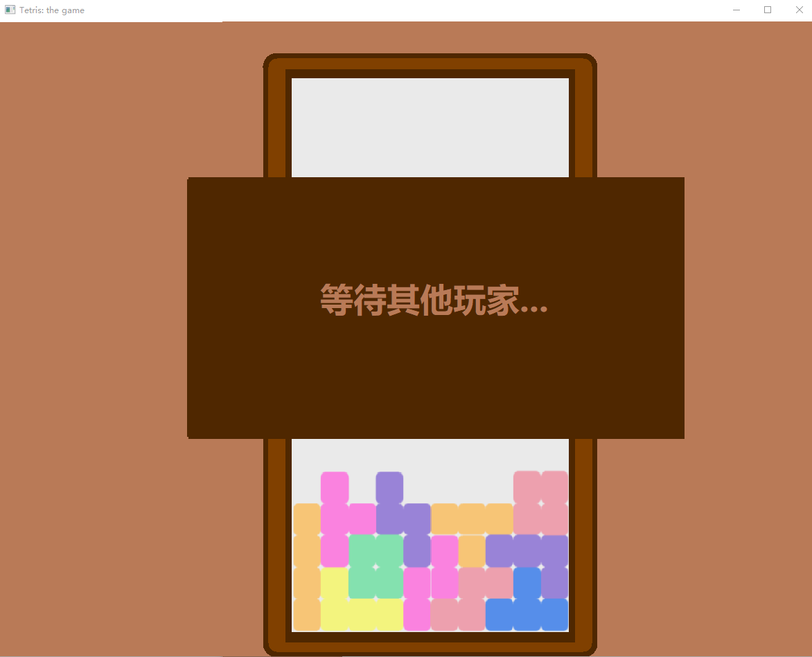

# Tetris Battle Assembly

Jialong Wu, Yishujie Zhao and Shuwei Huang (Equal Contribution)

## Introduction

Tetris game, supporting single player mode and multiplayer online battle, with funny items, implemented using *the Microsoft Macro Assembler (MASM)*.

Course project for Principles of Assembly and Compilation, instructed by [Prof. Wang](http://ise.thss.tsinghua.edu.cn/~wangchaokun/).

For details, see our report and slides (in Chinese).

## Development Environment

- IDE: Visual Studio 2019
- Assembler: MASM32
- OS: Win10.
## Run

Run `exe/tetris.exe` to start the game. You can choose single player or multiplayer mode in the game. If you start the game in multiplayer mode, please make sure the server is started first. When operating in the game, please turn off Chinese input or capitalization, otherwise the program cannot respond to keyboard events.

Run `exe/server.exe` to start the server. Please make sure that port `10086` is not occupied before running the server. The clock graphic is only for verifying that the server is not blocking with no other usage.

## Gameplay

Tetris, support single player mode and multiplayer mode. 

Enter the game and control the left and right keys and Enter key to select the game mode.

### Single Player Mode

Single player, no need to connect to server.

Game operations:

- Left and right keys to control the movement of the pieces,
- Up keys to control the rotation of the pieces,
- Down keys to accelerate the fall of the pieces, 
- 1, 2, 3 keys to use the corresponding items. 

Game items: 

- To destroy the bottom three rows
- To slow down
- To skip the next block

A one-time elimination of $n$ rows, will give $n-1$ items, with random types. At the beginning of the game, one random item will be given.

   

### Multiplayer Online Battle

1~4 players，need to connect to server.

Game operations:

  - Players need to follow the game prompts, enter the ip address and connect to the server.
  

      

  - After the player connects successfully, he needs to prepare to start the game according to the game prompt, and the game will start automatically when all players are ready.

     

  - Game operations are similar with those in single mode. The game will end when the block exceeds the game box, and all players will be ranked according to their survival time.
  

     

Game items:

- Bombs
- Weird-shaped pieces
- Screen occlusions

Note that a item will be applid on a random player, including yourself, for extra fun.

    

